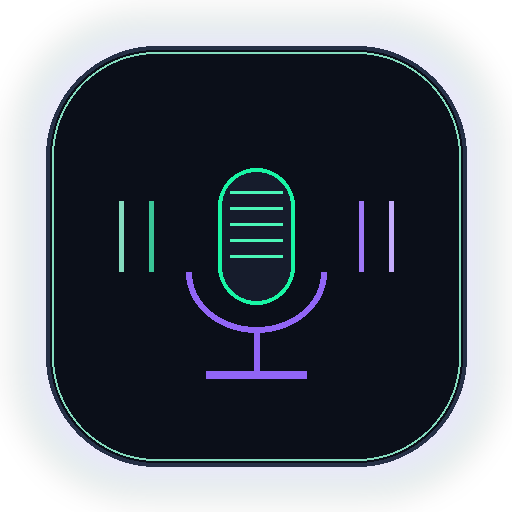

# Chirp — Instant AI Voice-to-Text for Windows

<p align="center">
  
</p>

<p align="center">
  <b>Ultra-fast floating voice dictation capsule for Windows.</b><br/>
  Speak anywhere → text appears instantly in any app.
</p>

---

## ✨ Features

- 🎙️ **Instant dictation** — press F8, speak, text types itself in any focused window
- ⚡ **Sub-1 second** latency (silence detection + Google Speech API)
- 🌐 **Multilingual** — Hindi, Hinglish, English auto-detected
- 🤖 **3 AI Engines** — OpenAI Whisper, Google Gemini, or Free Web Speech
- 🔴 **Live VU meter** — animated soundwave visualizer while listening
- 💎 **Premium glassmorphic UI** — floating pill capsule, always on top, never steals focus
- 🔁 **Auto-restart watchdog** — never stops listening, self-heals on any error
- ⌨️ **Works everywhere** — Notepad, Word, Chrome, VS Code, anywhere

---

## 🚀 Quick Start

### Download EXE (Windows)
Download `Chirp.exe` from [Releases](../../releases) — no install needed, just run it.

### Run from Source
```bash
pip install pyaudio SpeechRecognition pyperclip pywin32 keyboard requests
python chirp_app.py
```

---

## 🎮 Usage

| Action | How |
|--------|-----|
| **Start / Stop listening** | Click the capsule or press `F8` |
| **Switch AI engine** | Click the badge on the right (OpenAI / Gemini / Web) |
| **Set API keys** | Right-click → API Keys Settings |
| **Change language** | Right-click → Language |
| **Move capsule** | Drag anywhere on screen |

---

## ⚙️ AI Engines

| Engine | Speed | Requires |
|--------|-------|---------|
| **Web Speech** (default) | ~500ms | Free, no key needed |
| **OpenAI Whisper** | ~800ms | OpenAI API key |
| **Google Gemini** | ~1.5s | Gemini API key |

> Web Speech is recommended — it's fast, free, and handles Hindi + Hinglish perfectly.

---

## 🛠️ Build from Source

```bash
pip install pyinstaller
python -m PyInstaller --clean Chirp.spec
python deploy_chirp.py
```

---

## 📁 Project Structure

```
Chirp/
├── chirp_app.py       # Main application
├── Chirp.spec         # PyInstaller build config
├── deploy_chirp.py    # Desktop deployment script
├── make_chirp_icon.py # Icon generator
├── chirp.ico          # App icon
└── chirp_logo.png     # Logo
```

---

## 📄 License

MIT License — free to use, modify, and distribute.
